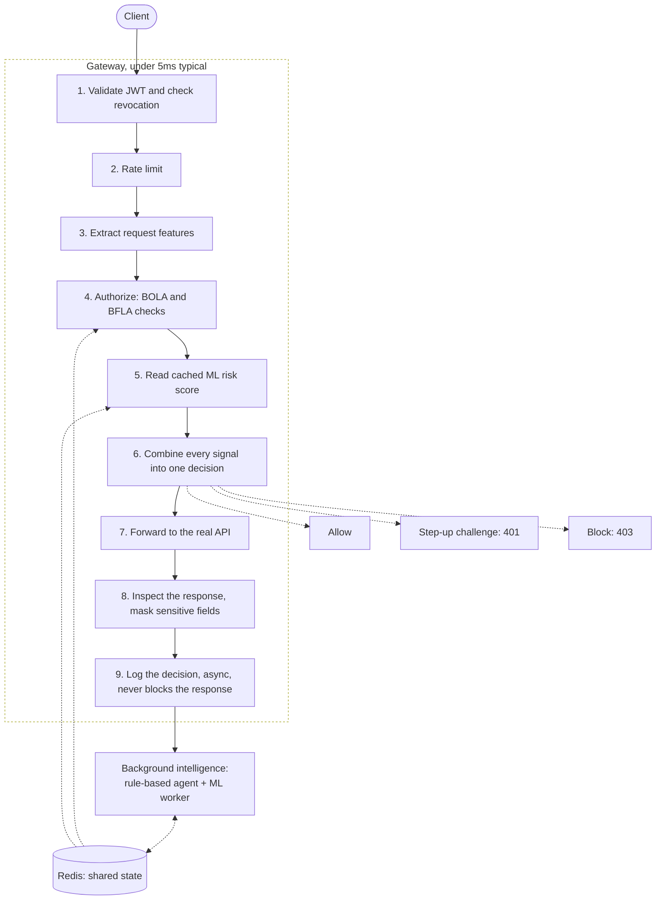

# Project0

A Zero Trust API Security Gateway. It sits in front of your APIs, inspects
every request before it reaches them, and decides in real time whether to
allow it, challenge it, or block it.

**Naming note:** this GitHub repository is called `NeuroBots` (its original
name). The product itself is called `Project0`. Same codebase, same repo,
no separate fork. Every script, container, and doc in here uses the
product name.

## The problem this solves

A logged-in user with a completely valid login token asks for data that
belongs to someone else. The request looks perfectly normal: the token is
real, the syntax is correct, nothing is technically broken. Most security
tools let it straight through, because they only check whether a request
*looks* malformed, not whether the person making it actually owns what
they're asking for.

This specific gap is called Broken Object Level Authorization, or BOLA. It
is the single most common cause of real API data breaches, including the
T-Mobile breach that exposed 37 million customer records in 2023, and the
Optus breach in Australia. Project0 catches this class of attack as it
happens, using both fixed security rules and real trained machine learning
models, and it has been tested to correctly allow every legitimate request
while catching every attack in its test suite.

## What it actually does

- Checks every request's login token for validity, expiry, and whether it
  has been revoked
- Limits how many requests one user can make in a short window, to stop
  scraping and brute force
- Checks whether the person making a request actually owns the object or
  account they're asking for (this is the BOLA check)
- Checks whether the person is allowed to call the specific function they
  are calling, not just any function (this is the BFLA check)
- Scores every request for risk using both fixed rules and real trained
  machine learning models, and only blocks when there is strong enough
  evidence, so a single uncertain signal never blocks a real user by
  itself
- Automatically and temporarily restricts a specific identity or IP
  address after it is caught attacking, without a human needing to step in
- Automatically raises the security posture of one specific resource if it
  comes under attack from many different sources at once, even if no
  single attacker crosses any individual threshold
- Masks sensitive fields like SSNs before they leave the gateway, even if
  the backend API behind it forgets to
- Shows everything happening live on a dashboard: which requests were
  blocked and why, which identities are suspicious, an interactive map of
  who can access what, and a plain-language summary report generated on
  demand from real audit data

None of the decisions above are made by a language model. Every block, and
every explanation for a block, comes from deterministic code, so nothing a
judge or an operator reads can be a hallucination.

## How a request actually flows



Steps 1 through 8 are what the request actually waits on. The ML models and
the rule-based agent both run in the background and only ever feed a
pre-computed score back into step 5. If either one is slow, or down
entirely, the request in front of you is never affected.

The full diagram set, including the autonomous mitigation sequence and the
horizontal scaling diagram, is in `markdown/ARCHITECTURE.md`.

## Run it, one command

```bash
python3 run.py
```

This starts Redis and PostgreSQL if Docker is available (the gateway works
fine without them too, falling back to in-memory state), installs backend
and frontend dependencies the first time you run it, then starts the demo
API, the gateway, the ML worker, and the dashboard, all from one terminal.
It waits on real health checks between each step rather than guessing with
a fixed delay. Ctrl-C stops everything it started.

Then, in a second terminal, fire real attack traffic at it:

```bash
cd backend && python3 attack_sim/simulate.py
```

This sends real HTTP requests, no mock data, and prints a scorecard. A
clean run detects every attack class in the suite and correctly allows
every legitimate request, with zero false positives. Run it once per
gateway start; `markdown/TESTING.md` explains why running it twice in a
row without restarting produces a misleading number.

Other ways to run the stack, including Docker Compose and a fully manual
walkthrough, are in `markdown/DEMO.md`.

## Repository layout

```
backend/    The FastAPI gateway: JWT validation, BOLA/BFLA detection, rate
            limiting, autonomous mitigation, the Intelligence Console
  routes.json           the protected route table. Edit this, no redeploy needed
  seed_ownership.json   pre-provisioned object ownership, loaded at startup
ml/         The real ML worker: IsolationForest, a Markov sequence model,
            a NetworkX access graph, and a from-scratch Graph Attention
            Network plus Graph Convolutional Network
frontend/   The React dashboard. Reads real gateway state, no simulated data
markdown/   Every other doc in this repo
run.py      Starts everything with one command, see above
```

### Protecting a new endpoint

`backend/routes.json` is the route table, read at startup. Adding an entry
there is what gives a path ownership checks and role checks. No code
change, no redeploy. Anything under a protected prefix that isn't listed
there still requires a valid token; listing it adds real authorization on
top of that.

## Documentation

Everything else lives in `markdown/`.

| Doc | What it covers |
|---|---|
| `ARCHITECTURE.md` | the component diagram, the 9-step decision pipeline, autonomous mitigation, horizontal scaling |
| `TESTING.md` | how to run the attack suite, the contract check, and the benchmark, and what a bad result usually means |
| `DEPLOYMENT.md` | secret rotation, a fail-closed startup check, verified horizontal scaling |
| `backend/PERFORMANCE.md` | real measured latency numbers, including a known gap under real concurrent load, disclosed rather than hidden |
| `BENCHMARK.md` | the latest measured throughput and latency numbers |
| `DEMO.md` | every way to run the full stack |
| `PRESENTATION.md` | presentation slide source material |

`markdown/backend/README.md` and `markdown/backend/MEMORY.md` cover the
gateway in full, including every real bug that was found and fixed and why
it mattered. `markdown/frontend/README.md` covers the dashboard.
`markdown/ml/README.md` covers the ML worker.

## Verifying it yourself

```bash
cd frontend && node contract-check.mjs
```

This runs the dashboard's own data-transform functions against live
gateway responses and checks that every field every panel renders is
actually present. Run it after the attack simulator, so there's real
traffic to check against.

Redis and PostgreSQL are both optional for a local demo; the gateway falls
back to in-memory state for either one automatically. The ML worker does
need a real Redis, since it runs as a separate process and shares state
through Redis rather than memory. Without it running, nothing breaks: the
gateway just loses one of its two anomaly signals. See
`markdown/TESTING.md` for the complete verification suite, and
`markdown/DEPLOYMENT.md` before running this anywhere other than your own
laptop. The default `JWT_SECRET` and `ADMIN_API_KEY` shipped here are demo
values only.

## Technology stack

Backend: Python, FastAPI, httpx, PyJWT, WebSockets. Frontend: React, Vite.
Machine learning: scikit-learn, NetworkX, and a from-scratch Graph
Attention Network plus Graph Convolutional Network in NumPy. Shared state:
Redis. Durable audit log: PostgreSQL. Deployment: Docker and Docker
Compose. Standards followed: the OWASP API Security Top 10 and MITRE
ATT&CK.
