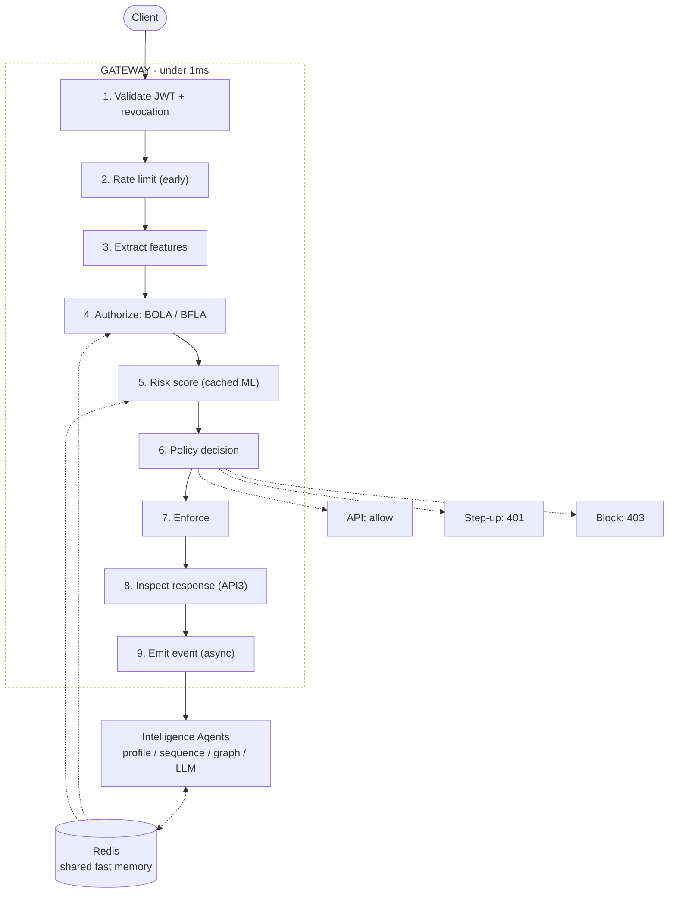

# Project 0

Zero Trust API Security Intelligence and Autonomous Authorization Protection
Platform.

**Naming note:** the GitHub repository is called `NeuroBots` (its original
name); the product itself is `Project 0`. Same codebase, no separate fork —
every script, container and doc below refers to the product name.

## The problem, in one sentence

A logged-in user with a perfectly valid token asks for data that belongs to
someone else, the request looks completely normal, and most API gateways let
it through because nothing about it is technically broken. This is Broken
Object Level Authorization (BOLA), OWASP's #1 API risk, and the pattern
behind real breaches like T-Mobile (37M records, 2023) and Optus. Project0
is a reverse-proxy gateway that catches this class of attack in real time,
using both deterministic rules and real trained ML behavioral models, with a
verified zero false-positive rate.

## How a request actually flows



Kept in sync with `check_and_forward()` in `backend/main.py`. A more
detailed static version, plus the autonomous-mitigation and
horizontal-scaling diagrams, lives in `markdown/ARCHITECTURE.md`.

## Fastest way to run it

```bash
python3 run.py
```

One command. Starts Redis and PostgreSQL (Docker, if available — the
gateway falls back to in-memory state automatically if not), installs
backend/frontend dependencies on first run, then starts the demo upstream
API, the gateway, the ML worker, and the dashboard. Real health checks
between each step, not fixed sleeps. Ctrl-C stops everything cleanly.

```bash
cd backend && python3 attack_sim/simulate.py    # second terminal, once run.py is up
```

Fires real HTTP traffic at the running gateway and prints a scorecard: 18/18
attack classes detected, 18/18 legitimate requests correctly allowed, 0
false positives, plus a 6-step attack-chain scenario (recon, exploit,
escalate, pivot, evade — one identity). Run it once per gateway start; see
`markdown/TESTING.md` for why.

Other ways to run it — Docker Compose, the no-Docker scripts, a fully manual
five-terminal walkthrough — are in `markdown/DEMO.md`.

## Repository layout

```
backend/    FastAPI gateway: JWT validation, BOLA/BFLA detection, rate limiting,
            deterministic anomaly rules, autonomous escalation, audit log
  routes.json           the protected route table, edit it, no redeploy needed
  seed_ownership.json   pre-provisioned object ownership, loaded at startup
ml/         Real ML worker: per-entity IsolationForest, Markov sequence model,
            NetworkX access graph
frontend/   React/Vite dashboard, reads real gateway state, no simulated data
markdown/   Every doc in the repo except this README
run.py      python3 run.py starts everything from one command, see above
start_all.sh / stop_all.sh   the same idea without Docker/frontend
```

### Protecting a new endpoint

`backend/routes.json` is the route table, read at startup. Adding an entry
there is what gives a path object-level (BOLA) and role-level (BFLA) rules —
no code change, no redeploy. Anything under a protected prefix that is *not*
listed there still requires a valid token; listing it adds authorization on
top of authentication.

## Documentation

All documentation lives in `markdown/`.

| Doc | What it covers |
|---|---|
| `ARCHITECTURE.md` | component graph, the 9-step decision pipeline, autonomous mitigation and hardening, horizontal scaling |
| `TESTING.md` | running the attack suite, the contract check, the benchmark, and how to read a bad result |
| `DEPLOYMENT.md` | secret rotation with a fail-closed startup gate, verified horizontal scaling, network exposure |
| `backend/PERFORMANCE.md` | measured latency numbers and how they were found |
| `BENCHMARK.md` | latest measured latency and throughput |
| `DEMO.md` | every way to run the full stack, including a manual five-terminal walkthrough |
| `PRESENTATION.md` | Round 2 presentation slide source material |
| `PRODUCT.md`, `BACKEND.md`, `FRONTEND.md`, `ML.md`, `DEVOPS.md` | the original per-track problem/solution briefs |

`markdown/backend/README.md` and `markdown/backend/MEMORY.md` cover the
gateway's full status and every real bug found and fixed, with why it
mattered. `markdown/frontend/README.md` covers the dashboard.
`markdown/ml/README.md` covers the ML worker.

## Verifying it yourself

```bash
cd frontend && node contract-check.mjs
```

Runs the dashboard's own transform functions over live gateway responses
and asserts every field every panel renders is actually present — run it
after the attack simulator, so there's real traffic to check against.

Redis and PostgreSQL are optional; the gateway falls back to in-memory
state for both when unreachable. The ML worker needs a real Redis, since
it's a separate process sharing state through Redis, not memory — without
it running, detection is unaffected, the gateway just loses one
corroborating signal. See `markdown/TESTING.md` for the full verification
suite (`simulate.py`, `verify_flow.py`, `contract-check.mjs`,
`benchmark.py`) and `markdown/DEPLOYMENT.md` before running this anywhere
that is not your laptop — the default `JWT_SECRET` and `ADMIN_API_KEY` are
demo values.

## Technology stack

Frontend: React, Vite. Backend/gateway: Python, FastAPI, httpx, PyJWT,
WebSockets. ML: scikit-learn (IsolationForest), NetworkX, a Markov chain
sequence model. Databases: Redis, PostgreSQL. Deployment: Docker, Docker
Compose. Standards: OWASP API Security Top 10, MITRE ATT&CK.

Reporting and narrative generation are deterministic templates over real
audit data, never a live LLM call — a security verdict must never be
hallucinated, so nothing that decides or explains a block is
model-generated.
