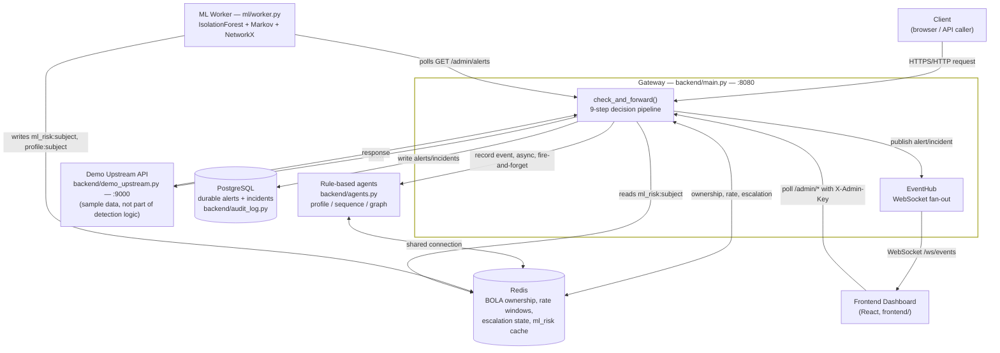
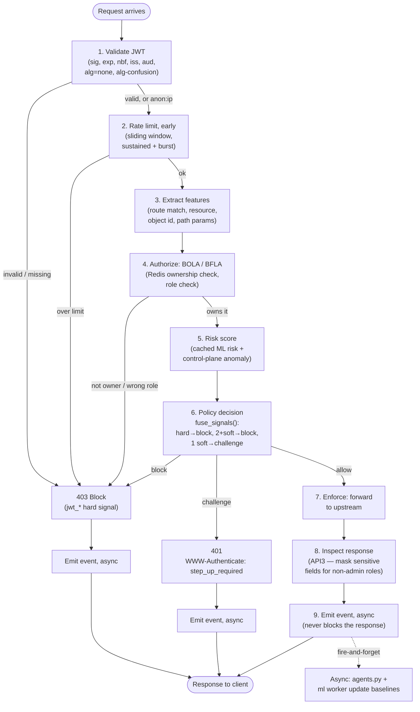
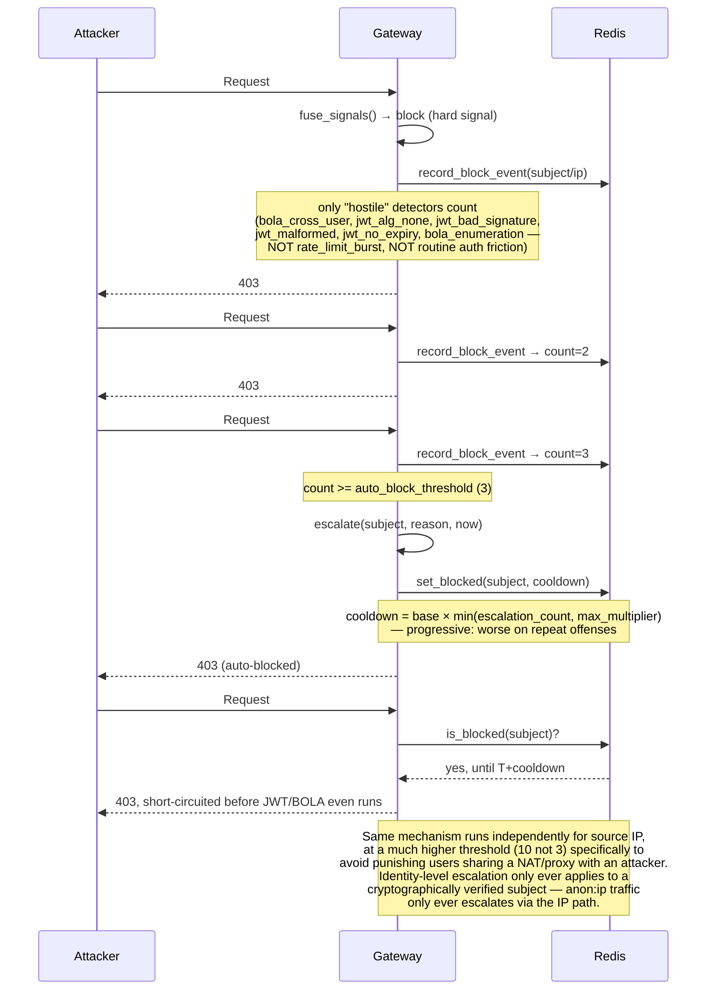
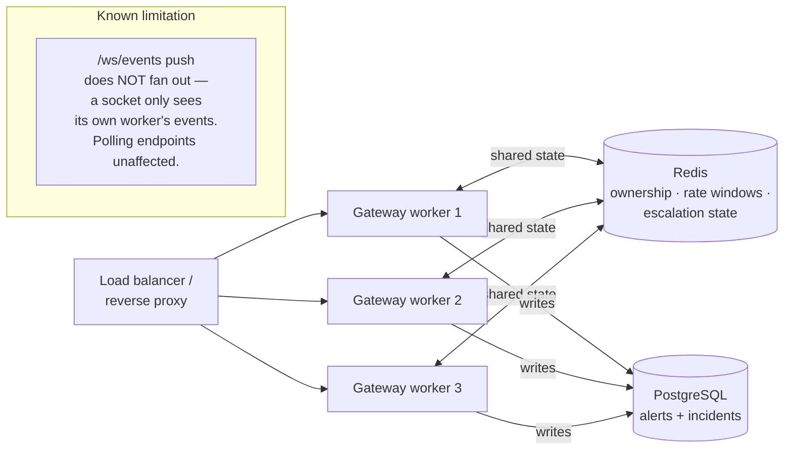

# Project0 Architecture

Diagram-based companion to `backend/MEMORY.md` (the full reasoning behind
every design decision, in prose) and `ml/README.md`. This file is the
picture; those files are the "why." All diagrams below reflect the actual
code as of 2026-08-08 — every component, file, and endpoint named here
exists and was verified running, not aspirational.

## 1. System components

Every arrow here is a real call in the code, not a planned one:
`store.py`/`agents.py` share one Redis client (`control_plane.use_client()`);
the ML worker is a fully separate process that only talks to the gateway
through its own public `/admin/alerts` endpoint and Redis, never imported
directly — if it isn't running, the gateway degrades to exactly what it was
before it existed, nothing in the request path depends on it.

## 2. The 9-step request flow

This is the same flow the reference architecture artifact diagrams
interactively; this version is the static, in-repo record of it, kept in
sync with `check_and_forward()` in `main.py`.

Steps 1–7 run inline, on the request's own critical path — this is what the
`<15ms` budget is measuring (see `backend/PERFORMANCE.md`: p50 0.05–0.08ms,
p99 0.3–0.6ms, measured, not estimated). Step 9's async emission is the only
thing that ever touches the intelligence layer; a slow or unreachable ML
worker or Redis never adds latency to a live request, by construction.

## 3. Autonomous mitigation escalation

The system remembers a proven attacker across requests instead of
re-deciding from scratch every time — this is the part of the flow that
isn't in the reference architecture's per-request diagram, because it spans
multiple requests over time.

Verified against real traffic, not just read off the code: `/admin/incidents`
after a real attack-sim run shows genuine `auto_block_escalation` events for
both an identity (`scanner`, after repeated enumeration) and a source IP
(`ip:127.0.0.1`, after the suite's own aggregate hostile traffic crossed the
threshold) — see `backend/MEMORY.md` for the exact incident records and what
they revealed about safely re-running the attack suite.

## 4. OWASP API Top 10 coverage

| # | Category | Status | Detector |
|---|---|---|---|
| API1 | Broken Object Level Authorization | Covered | `bola_cross_user`, `bola_enumeration` — `backend/detect.py` |
| API2 | Broken Authentication | Covered | `jwt_*` family — `backend/auth.py` |
| API3 | Broken Object Property Level Authorization (excessive data exposure) | Covered | `excessive_data_exposure_prevented` — `backend/security_checks.py`, response-body redaction |
| API4 | Unrestricted Resource Consumption | Covered | rate limiting, sustained + burst — `backend/detect.py` |
| API5 | Broken Function Level Authorization | Covered | `bfla_role_violation` — `backend/detect.py` |
| API6 | Unrestricted Access to Sensitive Business Flows | Covered | `control_plane_anomaly`, `ml_anomaly` soft signals — `backend/agents.py`, `ml/` |
| API7 | Server-Side Request Forgery | Covered | `ssrf_internal_target` — `backend/security_checks.py`, scans request bodies for RFC1918/link-local/cloud-metadata targets |
| API8 | Security Misconfiguration | Covered | `GET /admin/config-audit` + security-headers middleware — `backend/security_checks.py` |
| API9 | Improper Inventory Management | Covered | `shadow_endpoint_access` for unlisted routes under a protected prefix — `backend/security_checks.py` |
| API10 | Unsafe Consumption of APIs | Not attempted, by design | This gateway is an inbound reverse proxy — it doesn't consume third-party APIs on the tenant's behalf, so API10 isn't a meaningful axis for it |

## 5. Horizontal scaling (`WORKERS=N`)

Verified with real `WORKERS=3` against real Docker Redis + Postgres on
2026-08-08: rate limiting, BOLA ownership, and identity-level auto-escalation
all confirmed correctly shared across all 3 independent processes — and
confirmed to genuinely diverge when Redis is unreachable, proving the shared
state actually matters rather than assuming it. See `DEPLOYMENT.md` for the
full methodology (including a real test-methodology bug caught and fixed
along the way) and `backend/MEMORY.md` for the incident-level detail.

## 6. Where the diagrams above are proven, not just drawn

- Flow diagram (§2): every step corresponds 1:1 to a numbered comment in
  `check_and_forward()` in `backend/main.py`.
- Escalation sequence (§3): every message corresponds to a real function call
  (`store.record_block_event`, `escalate`, `store.set_blocked`,
  `store.is_blocked`) in the same file, and was re-confirmed against real
  `/admin/incidents` output on 2026-08-08 (see `backend/MEMORY.md`).
- Component diagram (§1): every edge is a real network call or shared
  connection in the running system — reachable and testable via the commands
  in `backend/PERFORMANCE.md` and `../backend/attack_sim/simulate.py`.

For the reasoning behind each design decision (why hard/soft signal
separation, why BOLA ownership is first-touch, why the ML risk signal is
always soft, why escalation thresholds differ for identity vs. IP) see
`backend/MEMORY.md` — this file is deliberately just the shape of the
system, not the argument for it.
